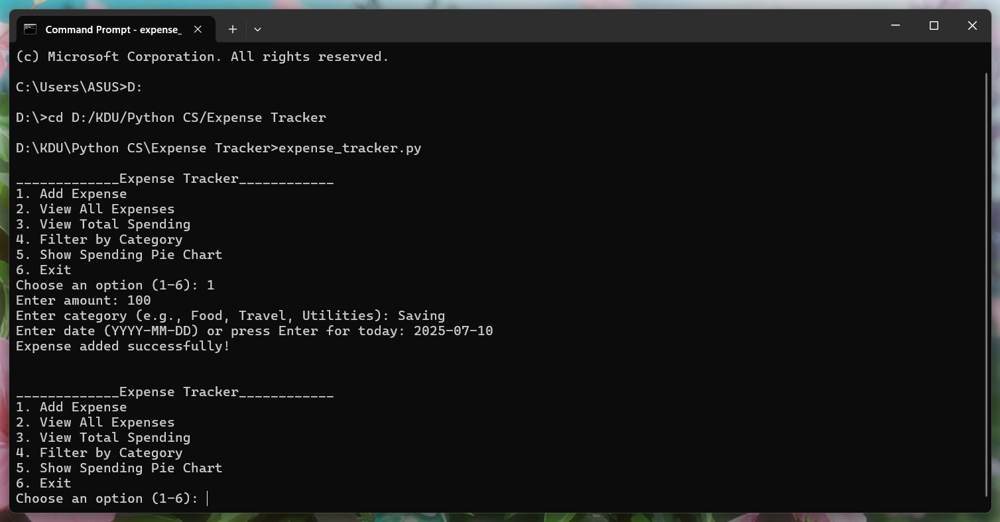
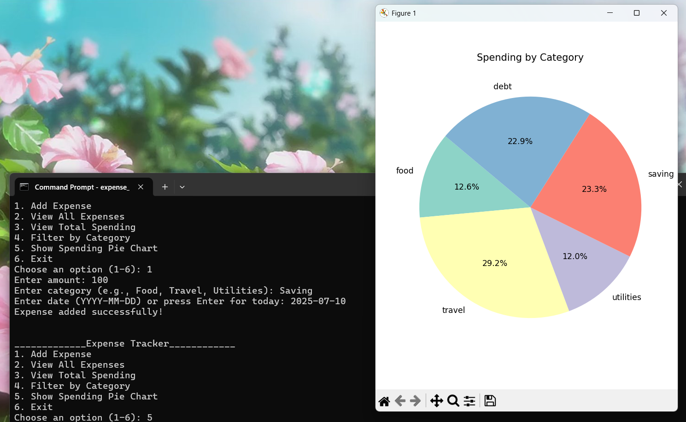

# 💡 Expense Tracker CLI (Python)

This is a simple command-line Python application for tracking daily expenses. It allows users to log, view, and analyze their expenses directly through a terminal.

## 📌 Features

- Add expenses (date, category, amount)
- View all expenses
- Filter expenses by category
- View total spending
- Show a pie chart of spending by category (using matplotlib)
- Data stored in a local CSV file

## 🛠 Technologies Used

- Python
- CSV module
- Matplotlib
- Defaultdict (collections)

## ▶ How to Run

1. Install required library:
   ```bash
   pip install matplotlib

## 📷 CLI Screenshots

### 📌 Menu Interface & Add Expense Interface



### 📊 Pie Chart Output


