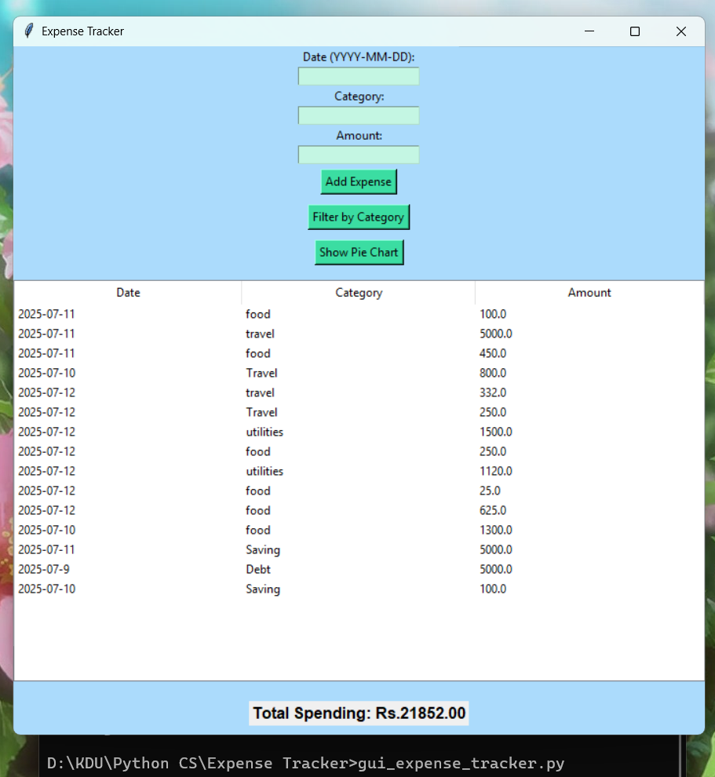
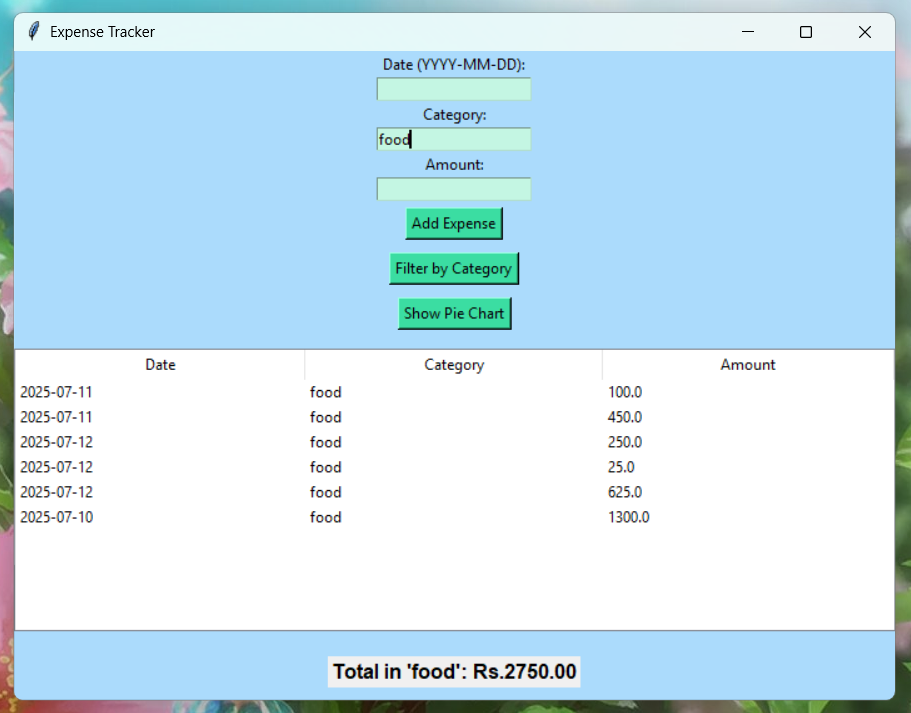
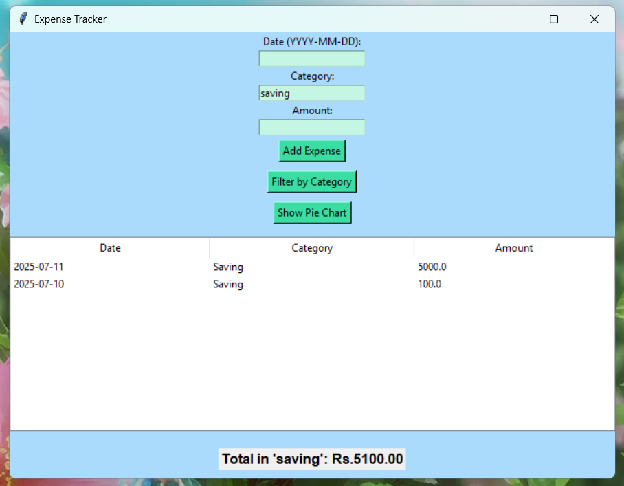
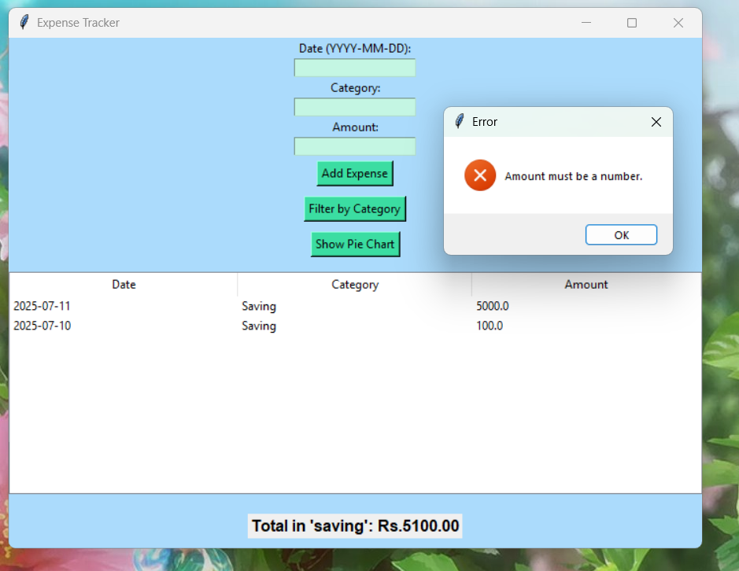

# 🖥️ Expense Tracker GUI (Tkinter + Matplotlib)

This is a graphical user interface (GUI) application for tracking personal expenses using Python. Built with Tkinter and Matplotlib, it allows users to manage their spending in an interactive way.

## 📌 Features

- Add expenses with date, category, and amount
- View all records in a table (Treeview)
- View total spending
- Filter expenses by category
- Show a pie chart of spending by category
- Data is saved in a `.csv` file for persistence

## 🛠 Technologies Used

- Python
- Tkinter (GUI)
- Matplotlib (for pie chart)
- CSV module

## ▶ How to Run

1. Install `matplotlib` if not already installed:
   ```bash
   pip install matplotlib

## 📷 GUI Screenshots

### 📌 GUI Interface


### ➕ Filter 




### 📊  Error Interface

